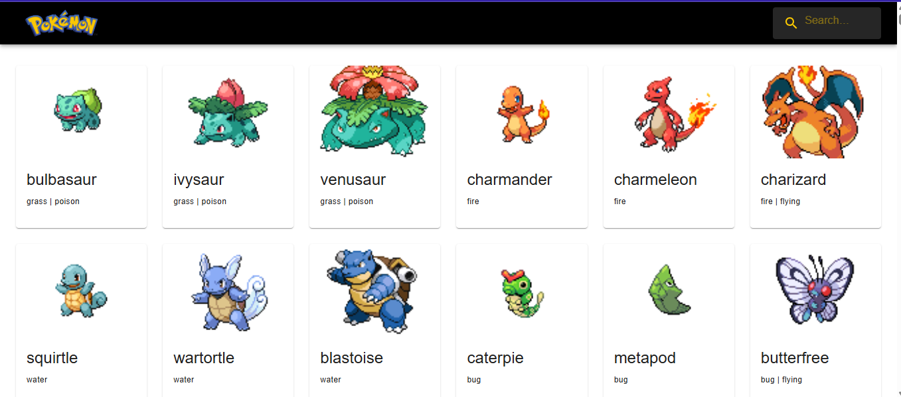

# 🧩 Pokedex React

Uma Pokédex simples desenvolvida com **React + Vite**, consumindo a [PokéAPI](https://pokeapi.co/) para exibir informações de Pokémon em tempo real.

---

## 🖼️ Prévia da aplicação



---

## 📌 Funcionalidades

- 🔍 Pesquisa por Pokémon pelo nome
- 📦 Listagem de Pokémon com imagens, nome e tipos
- 🎨 Interface inspirada no tema clássico de Pokédex
- ⚡ Consumo da PokéAPI
- 💡 Design responsivo

---

## 🚀 Tecnologias utilizadas

- [React](https://reactjs.org/)
- [Vite](https://vitejs.dev/)
- [PokéAPI](https://pokeapi.co/)
- HTML5 + CSS3 + JavaScript (ES6+)
- Axios (ou Fetch API)

---

## ▶️ Como rodar localmente

```bash
# Clone o repositório
git clone https://github.com/Davi300Git/Pokedex_React.git

# Acesse o diretório
cd Pokedex_React

# Instale as dependências
npm install

# Rode o projeto
npm run dev

# Acesse: http://localhost:5173
```

---

## 🌐 Acesse online

🔗 [Clique aqui para acessar a Pokédex online](https://pokedex-react-one-green.vercel.app)

---

## 🙋‍♂️ Desenvolvedor

Feito com 💜 por **[Davi300Git](https://github.com/Davi300Git)**  
Sinta-se livre para dar sugestões, abrir issues ou contribuir com melhorias!
